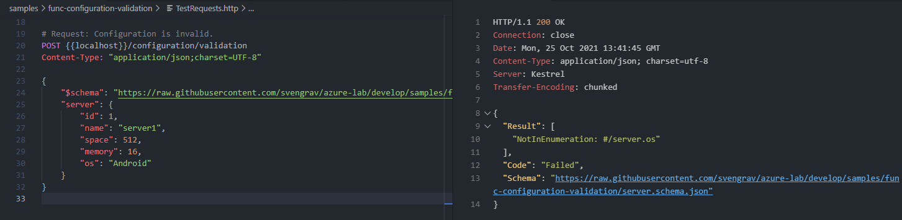

# Json Validation with PowerShell 7 and Azure Function
- This function validates a Json configuration against the schema specified in the Json and returns the result.

## Samples
- Execute with [REST Client](https://marketplace.visualstudio.com/items?itemName=humao.rest-client)
```Http
POST {{localhost}}/configuration/validation
Content-Type: "application/json;charset=UTF-8" 

{
    "$schema": "https://raw.githubusercontent.com/svengrav/azure-lab/develop/samples/func-configuration-validation/server.schema.json",
    "server": {
        "id": 1,
        "name": "server1",
        "space": 512,
        "memory": 16,
        "os": "Windows"
    }
}

# Request: Configuration is invalid.
POST {{localhost}}/configuration/validation
Content-Type: "application/json;charset=UTF-8" 

{
    "$schema": "https://raw.githubusercontent.com/svengrav/azure-lab/develop/samples/func-configuration-validation/server.schema.json",
    "server": {
        "id": 1,
        "name": "server1",
        "space": 512,
        "memory": 16,
        "os": "Android"
    }
}
```
- The result of an invalid config


## HowTo
- Check this: [Quickstart: Azure Function with VsCode](https://docs.microsoft.com/en-us/azure/azure-functions/create-first-function-vs-code-powershell)